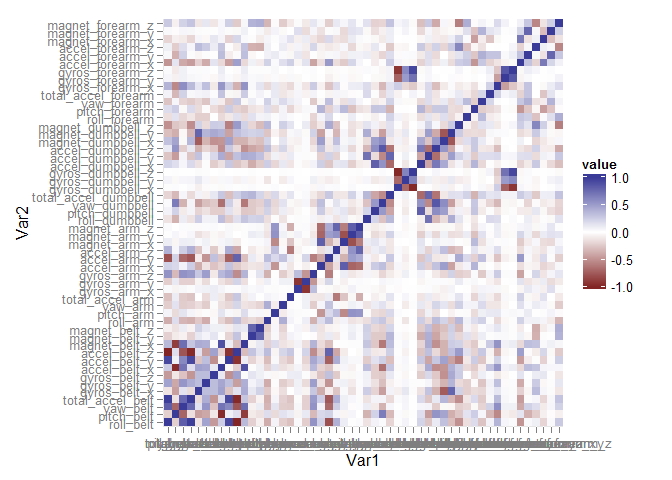
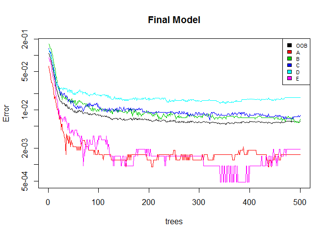
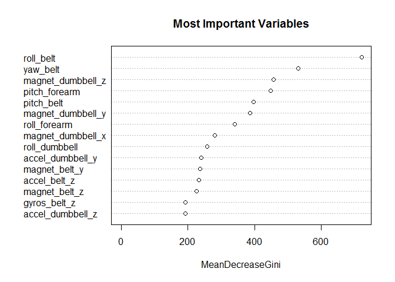

# Prediction of Barbell Lifts by Accelerometers
## Context
The goal of the project is to predict one of five manners (one correct, four specifically incorrect) to perform barbell lifts by accelorometric data taken from: "Ugulino, W.; Cardador, D.; Vega, K.; Velloso, E.; Milidiu, R.; Fuks, H. Wearable Computing: Accelerometers' Data Classification of Body Postures and Movements. Proceedings of 21st Brazilian Symposium on Artificial Intelligence. Advances in Artificial Intelligence - SBIA 2012. In: Lecture Notes in Computer Science. , pp. 52-61. Curitiba, PR: Springer Berlin / Heidelberg, 2012".

## Summary
On the cleaned dataset a random forest analysis was run twice. Once with an a priori PCA analysis and once without. The second model on the raw data lead to higher accuracy and was selected as final model for the prediction of the 20 test cases.

### 1. Load the datasets and preprocess 
After loading the datasets, any information not useful for classification was removed: the summary-rows of each time window, columns with more than 75% missing values, and the first columns indicating specific information on the collection time and person. The check for near-Zero-variance did not result in dropping additional data, resulting in 53 variables (52 are used for prediction, the variable "classe" is the relevant outcome).

```r
train <- read.csv("https://d396qusza40orc.cloudfront.net/predmachlearn/pml-training.csv", 
                  na.strings=c("NA","", "#DIV/0!"),)
test <- read.csv("https://d396qusza40orc.cloudfront.net/predmachlearn/pml-testing.csv",
                 na.strings=c("NA","", "#DIV/0!"))

train$classe<-as.factor(train$classe)
train <-train[!(train$new_window =="yes"),colSums(is.na(train)) < nrow(train) * 0.75]
train <-train[, -c(1:7)]
```
The training data is split into a training set and a validation set containing 60% and 40% of the data, respectively. This should be adequate for the (medium) size of the dataset.


```r
library(caret)
```

```
## Loading required package: lattice
## Loading required package: ggplot2
```

```r
set.seed(2110)
inTrain <- createDataPartition(y=train$classe, p=0.6, list=FALSE)
training <- train[inTrain,]
train_cv <- train[-inTrain,]
```
The covariation of the data is inspected by a correlation matrix. 

```r
library(ggplot2)
library(reshape2)
qplot(x=Var1, y=Var2, data=melt(cor(train[-c(53)], use="p")), fill=value, geom="tile") +
  scale_fill_gradient2(limits=c(-1, 1))
```

 
It can be seen in Figure 1 that there are some clusters of data, i.e. variables that a intercorrelated. To reduce the number of predictors, preprocessing PCA with additional BoxCox, center and caling transformation is done. 

```r
preProc <- preProcess(training[,-53],method=c("BoxCox", "center", "scale", "pca"), thres = 0.99)
trainPCA <- predict(preProc,training[,-53])
train_cvPCA <- predict(preProc, train_cv[,-53])
```
This preprocessed data is then used in a random forest algorithm (the PCs itself are not displayed as the main purpose is to classify, not to reduce dimensions). This random forest model is then applied to the test-validation dataset and the predictions of the model against the truths is tabulated.

```r
library(randomForest)
```

```
## randomForest 4.6-10
## Type rfNews() to see new features/changes/bug fixes.
```

```r
set.seed(170615)
rf <- randomForest(training$classe ~ ., data = trainPCA)
predict_rf <- predict(rf, train_cvPCA)
confus <- confusionMatrix(train_cv$classe, predict_rf)
AccuracyPCA <- round(100*confus$overall[["Accuracy"]],2)
oos_error <- 100 - AccuracyPCA
```
The accuracy of this model is  97.37 % with an out-of-sample error of 2.63 %. In a real world setting, this would be considered more than sufficient. However, it will also be compared to the model on the raw data. 

```r
set.seed(471119)
rf_raw <- randomForest(training$classe ~ ., data = training)
predict_rf_raw <- predict(rf_raw, train_cv)
confus_raw <- confusionMatrix(train_cv$classe, predict_rf_raw)
Accuracy_raw <- round(100*confus_raw$overall[["Accuracy"]],2)
oos_error_raw <- 100 - Accuracy_raw
```
The accuracy of this model is  99.32 % with an out-of-sample error of only 0.68 %. Because of the higher accuracy, this model will be selected for the final prediction on the equally cleaned dataset with the 20 test cases (not shown).
The progression in accuracy for the five different categories and the overall OOB-error are shown in Figure 2.

```r
plot(rf_raw, log="y", lwd = 1.8, lty = 1, main = NA)
legend("topright", colnames(rf_raw$err.rate),col=1:6,cex=0.7,fill=1:6)
title(main = "Final Model")
```

 

The averaged and unscaled importance of the 15 most important variables is displayed in Figure 3.

```r
varImpPlot(rf_raw, scale = FALSE, main = "Most Important Variables", n.var = 15)
```

 
